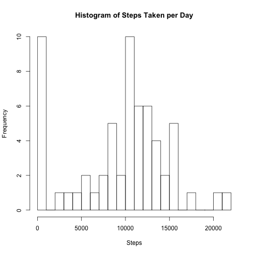
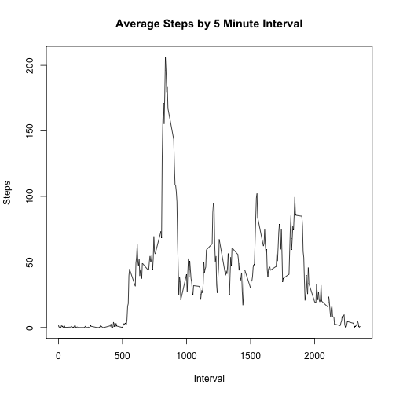
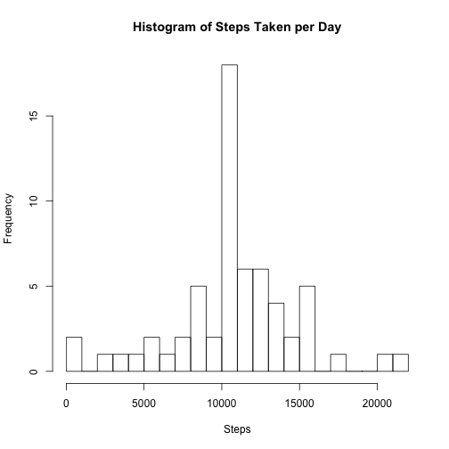
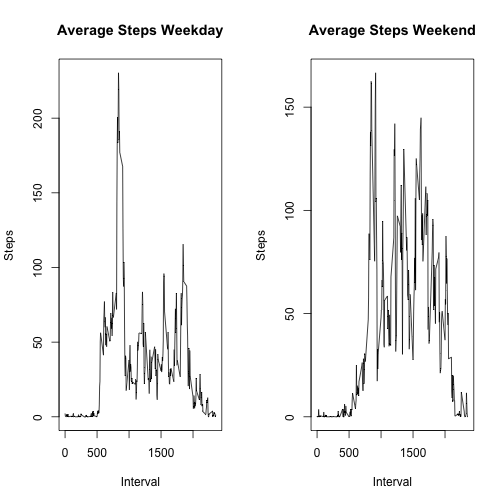

"Reproducible Research: Peer Assessment 1"
================================================

This is the first assignment in the Reproducible Research class from Coursera.

In this assignment I will be evaluating steps taken by a subject over the course of two months. Data was collected at 5 minute intervals throughout the day.

### Loading and preprocessing the data

I first read the data into a table from a local csv file.


```r
tabAll <- read.csv(file = "activity.csv")
tabAll$date2 <- as.Date(tabAll$date)
tabAll$factorInterval <- as.factor(tabAll$interval)
```

### What is mean total number of steps taken per day?

Here I sum the number of steps per day and create a histogram. I then calculate the mean and median number 
of steps per day.


```r
## Calc total # of steps taken per day
stepsByDate <- split(tabAll$steps,tabAll$date)
stepsByDateCount <- lapply(stepsByDate,sum, na.rm=TRUE)     ##  apply the sum function along the list
vectorSteps <- unlist(stepsByDateCount)

## Histogram of total # of steps taken per day
par(mfrow = c(1, 1))
hist(vectorSteps, breaks = 20, xlab = "Steps", ylab = "Frequency", main = "Histogram of Steps Taken per Day")
```



```r
## Mean and Median of total number of steps
mean(vectorSteps, na.rm=TRUE)
```

```
## [1] 9354.23
```

```r
median(vectorSteps, na.rm=TRUE)
```

```
## [1] 10395
```


### What is the average daily activity pattern?

Next I split the number of steps by the interval. I then provide a plot of that data, which gives an idea
as to the activity during the day. I also provide the interval which, on average, had the highest number of steps.


```r
## Time series plot of 5 minute intervals, avg over all days
stepsByInt <- split(tabAll$steps,tabAll$interval)
stepsByIntAvg <- lapply(stepsByInt,mean, na.rm=TRUE)

x <- unique(tabAll$interval)
y <- unlist(stepsByIntAvg)

xy <- cbind(x,y)
xy <- as.data.frame(xy)

plot(x,y,type = "l", xlab = "Interval", ylab = "Steps", main = "Average Steps by 5 Minute Interval")
```



```r
## Maximum 5 minute interval
y[which.max(y)]
```

```
##      835 
## 206.1698
```


### Imputing missing values

The raw data has a number of missing values. After showing the number of missing values, I fill in the missing values using the mean of the interval calculated previously.


```r
## Calculate number of missing values
nrow(tabAll[!complete.cases(tabAll),])
```

```
## [1] 2304
```

```r
tabAll <- tabAll

## fill in missing values (using mean for 5 min interval)
for (i in 1:length(tabAll$steps)) {
        if(is.na(tabAll$steps[i])) {
               for (j in 1:length(xy$x)) {
                        if(tabAll$interval[i]==xy$x[j]) {
                                tabAll$steps[i] <- xy$y[j]
                                j <- length(xy$x)+1
                          }
                  }
          }
  }
```

Now I create another histogram with the new data and provide the new averages.


```r
## Re-Calc total # of steps taken per day
stepsByDate2 <- split(tabAll$steps,tabAll$date)
stepsByDateCount2 <- lapply(stepsByDate2,sum, na.rm=TRUE)     ##  apply the sum function along the list
vectorSteps2 <- unlist(stepsByDateCount2)

## Mean and Median of total number of steps
mean(vectorSteps2)
```

```
## [1] 10766.19
```

```r
median(vectorSteps2)
```

```
## [1] 10766.19
```

```r
## Histogram of total # of steps taken per day
hist(vectorSteps2, breaks = 20, xlab = "Steps", ylab = "Frequency", main = "Histogram of Steps Taken per Day")
```



### Are there differences in activity patterns between weekdays and weekends?

Finally, I divide the data into weekday and weekend activity. From there I plot the data side-by-side to
highlight the differences in activity.


```r
## new factor variable - weekday and weekend
tabAll$dayofweek <- weekdays(tabAll$date2)
category <- function(x) if(x == "Saturday") "Weekend" else if (x == "Sunday") "Weekend" else "Weekday"
tabAll$weekday <- sapply(tabAll$dayofweek,category)


## panel plot containing time series plot of 5 min intervals
tabAllWeekday <- tabAll[tabAll$weekday=="Weekday",]
tabAllWeekend <- tabAll[tabAll$weekday=="Weekend",]

par(mfrow = c(1, 2))

stepsByInt <- split(tabAllWeekday$steps,tabAllWeekday$interval)
stepsByIntAvg <- lapply(stepsByInt,mean, na.rm=TRUE)

x1 <- unique(tabAllWeekday$interval)
y1 <- unlist(stepsByIntAvg)

xy1 <- cbind(x1,y1)
xy1 <- as.data.frame(xy1)

plot(x1,y1,type = "l", xlab = "Interval", ylab = "Steps", main = "Average Steps Weekday")

stepsByInt <- split(tabAllWeekend$steps,tabAllWeekend$interval)
stepsByIntAvg <- lapply(stepsByInt,mean, na.rm=TRUE)

x2 <- unique(tabAllWeekend$interval)
y2 <- unlist(stepsByIntAvg)

xy2 <- cbind(x2,y2)
xy2 <- as.data.frame(xy2)

plot(x2,y2,type = "l", xlab = "Interval", ylab = "Steps", main = "Average Steps Weekend")
```



This is the end of the document.
